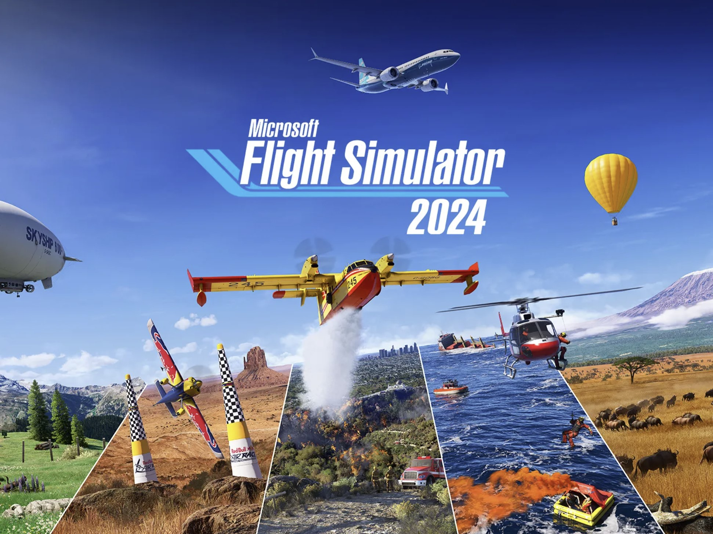
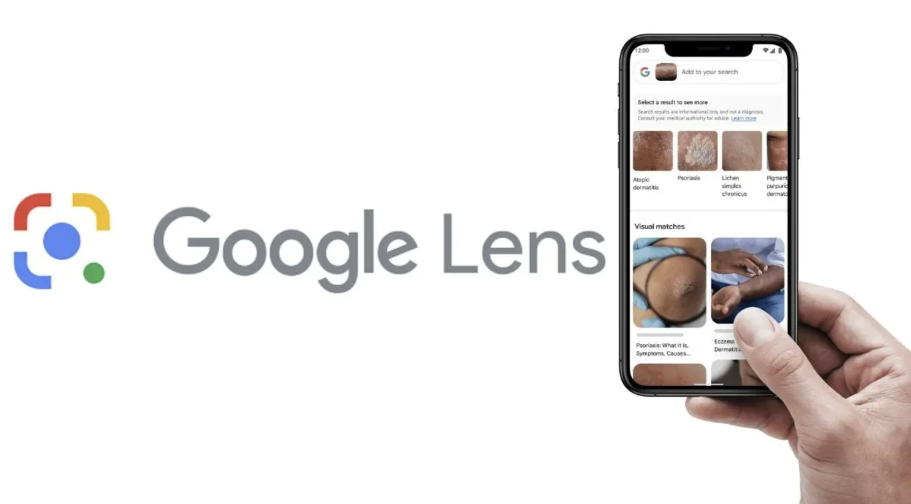

## PEC3: Las Gafas de Manovich

**Autor:** Víctor Hernández Lucas  
**Título del trabajo:** Hibridación en la era digital: Microsoft Flight Simulator y Google Lens

----------

## Introducción

La hibridación, según Lev Manovich, no es simplemente la suma de dos elementos, sino la creación de un tercero que transforma nuestra forma de interactuar con los medios y el mundo digital. En su libro _El software toma el mando_, Manovich analiza cómo la tecnología puede integrar diferentes componentes para generar experiencias únicas y significativas. En este ensayo, se explorarán dos ejemplos recientes que destacan por su capacidad de hibridar tecnologías y medios de manera innovadora: **Microsoft Flight Simulator** y **Google Lens**. Ambos casos ilustran cómo la hibridación tecnológica redefine las experiencias digitales y se convierten en ejemplos paradigmáticos del software cultural.

----------

## Ejemplo 1: Microsoft Flight Simulator

### Descripción

Lanzado por primera vez en 1982 y relanzado en 2020, **Microsoft Flight Simulator** es mucho más que un juego. Este simulador de vuelo es una herramienta sofisticada que utiliza una combinación de tecnologías para ofrecer una experiencia inmersiva y realista. Gracias a la integración de datos geográficos, inteligencia artificial y procesamiento en la nube, el simulador permite a los usuarios explorar el mundo desde el aire con un nivel de detalle impresionante.

### Hibridación tecnológica

La magia de Microsoft Flight Simulator radica en su capacidad de integrar múltiples tecnologías en un entorno cohesivo:

-   **Mapeo global y geografía realista**: Utiliza datos de **Bing Maps** para construir un modelo tridimensional del mundo con más de 37,000 aeropuertos, ciudades y paisajes.
-   **Clima en tiempo real**: Integra sistemas meteorológicos globales para replicar las condiciones del clima actual. Si está lloviendo en París, también lo hará en el simulador.
-   **Tráfico aéreo en vivo**: A través de datos de tráfico aéreo real, el simulador muestra la posición de aviones comerciales en tiempo real, ofreciendo una experiencia dinámica y actualizada.
-   **Azure AI**: Emplea inteligencia artificial para generar detalles como árboles, edificios y ríos que se adaptan al entorno en tiempo real.

### Contenido multimedia

En la imagen anterior, se aprecia una vista panorámica tomada directamente desde el simulador, mostrando cómo los datos geográficos y climáticos en tiempo real se combinan para crear una experiencia inmersiva.

-   **[Sitio oficial](https://www.flightsimulator.com/)**: Información, actualizaciones y descargas.
-   **[Trailer oficial en YouTube](https://www.youtube.com/watch?v=TYqJALPVn0Y)**: Una visión rápida de sus capacidades impresionantes.

----------

## Ejemplo 2: Google Lens

### Descripción

**Google Lens** es una herramienta que ha revolucionado la forma en que interactuamos con nuestro entorno a través de la cámara de los teléfonos inteligentes. Lanzada por Google en 2017, esta aplicación combina inteligencia artificial, aprendizaje automático y visión por computadora para analizar imágenes en tiempo real, ofreciendo soluciones inmediatas a problemas cotidianos.

### Hibridación tecnológica

Google Lens es un claro ejemplo de cómo la hibridación tecnológica puede transformar tareas comunes en experiencias innovadoras:

-   **Reconocimiento visual avanzado**: Utiliza algoritmos de visión por computadora para identificar objetos, plantas, animales y productos.
-   **Traducción en tiempo real**: Permite traducir texto capturado por la cámara, superponiendo la traducción en la pantalla mediante realidad aumentada.
-   **Búsquedas contextuales**: Conecta directamente con el motor de búsqueda de Google, proporcionando información instantánea sobre los objetos analizados.
-   **Procesamiento en la nube**: Todo el análisis se realiza en servidores remotos, garantizando respuestas rápidas y precisas.

### Contenido multimedia

En la imagen anterior, Google Lens está analizando un objeto en tiempo real, ofreciendo información contextual y resultados de búsqueda inmediatos.

-   **[Sitio oficial](https://lens.google/)**: Funciones, casos de uso y compatibilidad.
-   **[Demostración en YouTube](https://www.youtube.com/watch?v=LP8uZZV3-vQ)**: Cómo funciona Google Lens en acción.

----------

## Conclusión

Estos dos casos, Microsoft Flight Simulator y Google Lens, representan cómo la hibridación tecnológica redefine nuestra relación con los medios digitales. Ambos ejemplos integran datos en tiempo real, inteligencia artificial y software cultural para ofrecer experiencias inmersivas y prácticas. Como señala Manovich, la hibridación no solo transforma los medios existentes, sino que también crea nuevas herramientas que amplían nuestras capacidades y posibilidades. En un mundo cada vez más interconectado, estas tecnologías son solo el comienzo de una revolución híbrida que cambiará nuestra forma de vivir y aprender.
